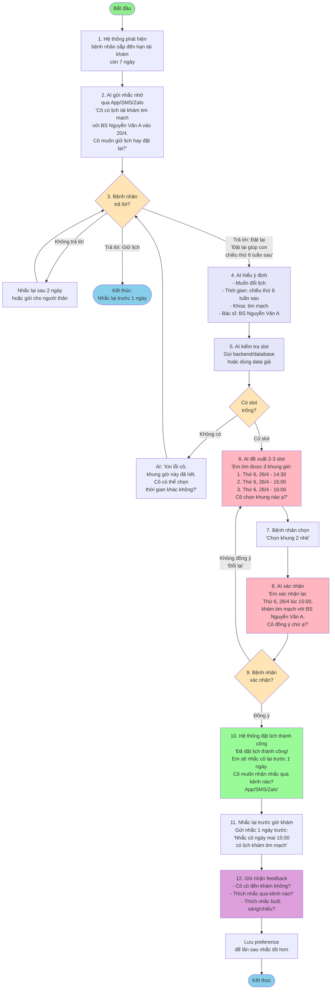
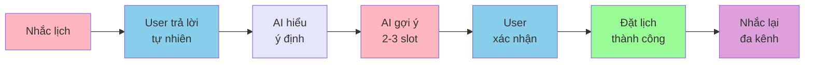
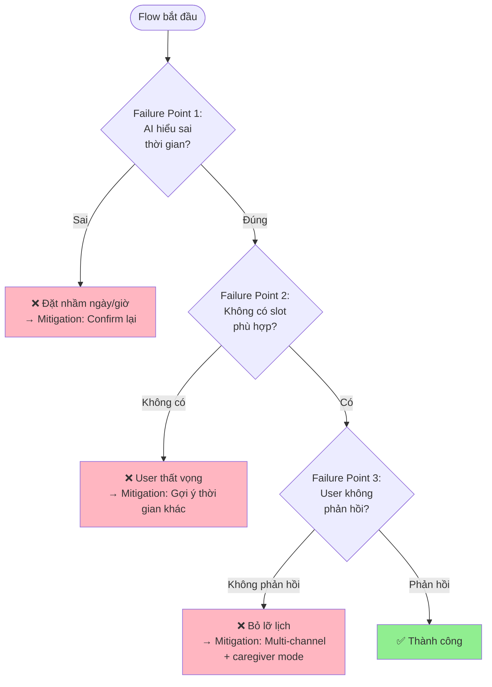

# AI Health Assistant - User Flow Diagram

## Flow chính (Mermaid)

## Giải thích màu sắc

- 🟢 **Xanh lá nhạt**: Điểm bắt đầu/kết thúc
- 🟡 **Vàng nhạt**: Điểm quyết định (decision point)
- 🟣 **Tím nhạt**: AI xử lý logic
- 🔴 **Hồng**: AI tương tác với user
- 🟢 **Xanh lá đậm**: Thành công
- 🟣 **Tím đậm**: Thu thập feedback

## Flow đơn giản hóa (cho demo 2 phút)

## Các failure points cần test (cho Người 5)

---

