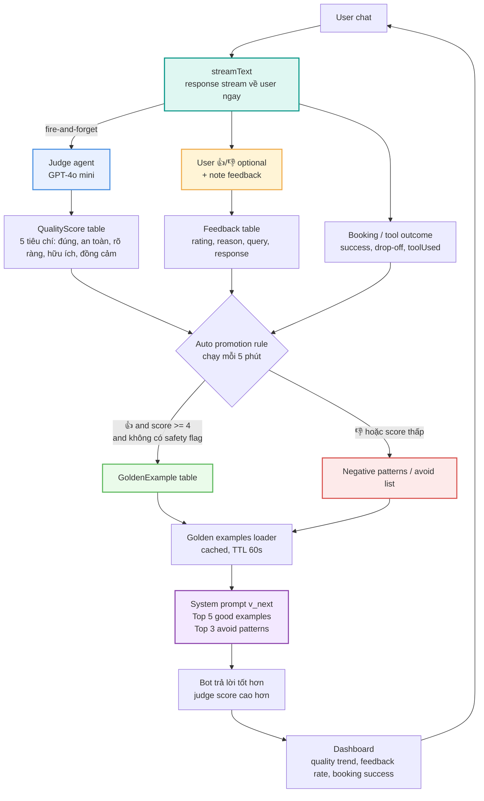

# Data Flywheel — Vinmec AI Health Assistant

_Cập nhật ngày 2026-04-09_

## 1) Mục tiêu
Dự án hiện tại của nhóm đã có khả năng **nhận dữ liệu trực tiếp từ khách hàng** qua chat, phản hồi rating, và ghi chú góp ý. Vì vậy, team có thể xây một **data flywheel** để dùng dữ liệu thật này nhằm cải thiện dần chất lượng assistant, độ chính xác gợi ý lịch, và trải nghiệm người dùng.

---

## 2) Vì sao dự án hiện tại phù hợp với data flywheel?
Từ code hiện tại, hệ thống đã có các điểm thu dữ liệu quan trọng:

- `app/api/chat/route.ts`: nhận hội thoại của user với AI assistant.
- `app/api/feedback/route.ts`: lưu phản hồi `up/down`, lý do, câu hỏi, câu trả lời, và `toolsUsed`.
- `lib/agent/tools/save-feedback-note.ts`: lưu góp ý dạng note từ user.
- `prisma/schema.prisma`: đã có các bảng `User`, `Appointment`, `Feedback` để lưu tín hiệu hành vi.
- `app/admin/feedback/page.tsx`: đã có dashboard + export JSONL để review dữ liệu.

=> Nghĩa là team **đã có nền tảng nhận data từ khách hàng**, chỉ cần tổ chức lại thành vòng lặp cải tiến liên tục.

---

## 3) Data Flywheel đề xuất

### Sơ đồ trực quan (Mermaid)

### Vòng lặp cốt lõi
1. **User tương tác với assistant**
   - hỏi thông tin tái khám,
   - xin gợi ý bác sĩ/chuyên khoa,
   - chọn slot,
   - đổi lịch hoặc xác nhận lịch.

2. **Hệ thống thu dữ liệu hành vi và phản hồi**
   - câu hỏi tự nhiên của user,
   - slot/time preference,
   - tools được gọi,
   - rating `thumbs up/down`,
   - lý do chê/khen,
   - kết quả cuối: có đặt được lịch hay không.

3. **Chuẩn hóa dữ liệu thành insight**
   - nhóm câu hỏi phổ biến,
   - câu trả lời bị chê nhiều,
   - intent nào AI hay hiểu sai,
   - slot nào được chấp nhận cao,
   - thời gian/kênh nhắc nào hiệu quả hơn.

4. **Cải thiện hệ thống**
   - update `system prompt`,
   - bổ sung FAQ/knowledge,
   - cải thiện ranking slot,
   - chỉnh UI chat, doctor card, slot chip,
   - thêm fallback/handoff khi AI không chắc.

5. **Trải nghiệm tốt hơn → có thêm user và thêm data tốt hơn**
   - user hài lòng hơn,
   - tỷ lệ hoàn tất đặt lịch tăng,
   - feedback rõ hơn,
   - hệ thống tiếp tục học từ vòng sau.

### Công thức ngắn gọn
**More usage → More feedback/data → Better assistant → Better booking experience → More usage**

---

## 4) Những loại dữ liệu nên đưa vào flywheel

| Nhóm dữ liệu | Dữ liệu cụ thể | Nguồn hiện có | Dùng để cải thiện gì? |
|---|---|---|---|
| **Intent data** | user hỏi gì, muốn đổi lịch khi nào, muốn khám ở đâu | `chat/route.ts` | hiểu đúng nhu cầu và prompt routing |
| **Preference data** | buổi sáng/chiều, bác sĩ nam/nữ, cơ sở gần nhất | chat + appointment flow | cá nhân hóa gợi ý slot |
| **Outcome data** | có chọn slot không, có xác nhận lịch không | `Appointment` | tối ưu conversion của flow |
| **Feedback data** | `up/down`, reason, note, toolsUsed | `feedback/route.ts`, `save-feedback-note.ts` | sửa câu trả lời tệ và lỗi tool |
| **Operational data** | tool nào hay fail, bước nào hay drop | logs + dashboard | tối ưu reliability và UX |

---

## 5) Flywheel cụ thể cho bài Vinmec của bạn

### A. Thu dữ liệu
Mỗi phiên chat nên lưu:
- `userId`
- câu hỏi gốc của user
- intent dự đoán (`đặt lịch`, `đổi lịch`, `hỏi chuẩn bị khám`, `tìm chuyên khoa`)
- tools đã gọi
- câu trả lời cuối của assistant
- user có bấm `up/down` không
- lý do nếu `down`
- có hoàn tất đặt lịch hay không

### B. Phân tích định kỳ
Mỗi tuần, team review:
- top 10 câu hỏi nhiều nhất,
- top 10 câu bị `downvote`,
- tỷ lệ hoàn tất đặt lịch,
- loại phản hồi phổ biến: `complaint / suggestion / compliment`,
- tool nào hay được gọi nhất và tool nào hay fail.

### C. Hành động cải tiến
Dựa trên dữ liệu đó, team sẽ:
- sửa `system prompt` để hỏi lại khi thiếu thông tin,
- thêm câu trả lời mẫu cho người cao tuổi,
- ưu tiên slot gần giờ/khu vực user hay chọn,
- bổ sung FAQ còn thiếu,
- cải thiện các nút UI để giảm thao tác nhập tay.

### D. Kết quả kỳ vọng
- tăng **reminder response rate**,
- tăng **slot acceptance rate**,
- tăng **rebooking completion rate**,
- giảm số case user phải gọi hotline/manual support.

---

## 6) Metrics nên gắn với data flywheel

### North-star metric
**Rebooking completion rate** = % user hoàn tất đặt/tái đặt lịch sau khi dùng assistant.

### Supporting metrics
- **Reminder response rate** = % user phản hồi sau khi được nhắc lịch.
- **Slot acceptance rate** = % user chọn một slot trong danh sách AI gợi ý.
- **Positive feedback rate** = % phản hồi `thumbs up`.
- **Escalation rate** = % case phải fallback sang người thật/hotline.
- **Repeat usage rate** = % user quay lại dùng assistant ở lần tiếp theo.

---

## 7) Data flywheel statement ngắn để đưa vào spec/poster

> **Data Flywheel của sản phẩm hoạt động như sau:** mỗi tương tác của bệnh nhân với AI assistant tạo ra dữ liệu về nhu cầu, sở thích thời gian, phản hồi chất lượng và kết quả đặt lịch. Dữ liệu này được lưu qua chat logs, feedback dashboard và booking outcome để nhóm liên tục cải thiện prompt, UI và logic gợi ý slot. Khi hệ thống tốt hơn, người dùng hoàn tất đặt lịch dễ hơn, tạo thêm dữ liệu tốt hơn và làm flywheel quay nhanh hơn.

---

## 8) Điểm cộng khi trình bày với giảng viên / ban giám khảo
- Không chỉ có demo chat, mà còn cho thấy **sản phẩm biết học từ người dùng**.
- Có **feedback loop thật** nhờ rating + note + booking outcome.
- Có thể mở rộng thành hệ thống **personalization** và **continuous improvement** sau hackathon.
- Rất hợp với tiêu chí AI product thinking: **không chỉ build model/demo mà còn nghĩ đến learning loop**.

---

## 9) Lưu ý về an toàn dữ liệu
Vì đây là bài toán y tế, data flywheel phải đi kèm nguyên tắc:
- chỉ lưu dữ liệu cần thiết,
- ẩn/anonymize dữ liệu nhạy cảm khi phân tích,
- không dùng dữ liệu bệnh án nhạy cảm cho training bừa bãi,
- giữ bước xác nhận của con người trước khi đặt lịch thật.

---

## 10) Chốt một câu
**Dự án của nhóm đã có sẵn nền tảng để tạo data flywheel: thu phản hồi khách hàng → phân tích insight → cải thiện assistant và UI → tăng tỷ lệ đặt lịch thành công → thu thêm dữ liệu tốt hơn.**
